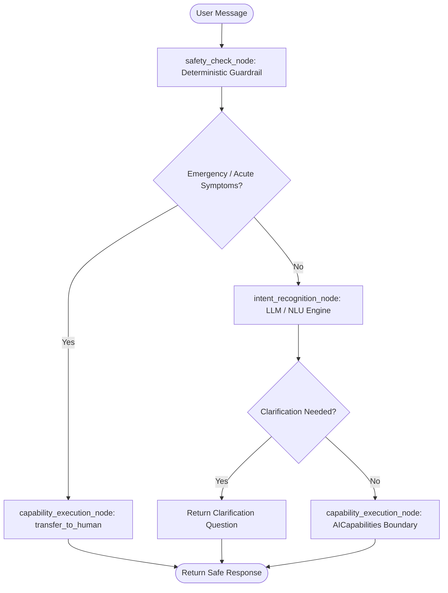

# HealthPulse AI: AI Agent Documentation

## 1. Scope & Healthcare Safety Policy

HealthPulse AI is designed exclusively as an **administrative healthcare assistant**.

### Permitted Capabilities:
- Discover approved hospitals and medical specialties
- Discover licensed active doctors based on symptoms and specialty
- Check real-time doctor availability and bookable slots
- Book, reschedule, and cancel outpatient appointments
- Present pre-visit intake questionnaires and collect responses
- Dispatch status notifications and trigger intake workflows
- Escalate clinical queries or emergency symptoms to human personnel

### Strict Clinical Restrictions:
- **Zero Diagnosis**: The AI never attempts to diagnose conditions (e.g. if the user says *"I have a cough and chest discomfort"*, the AI will never say *"You have pneumonia"*).
- **Zero Prescriptions**: The AI never prescribes, changes dosages, or recommends medications.
- **Zero Clinical Judgment**: The AI never advises a patient to delay seeing a physician or make independent clinical decisions.
- **Urgent Symptom Escalation**: Any mention of acute symptoms (chest pain, shortness of breath, heavy bleeding, loss of consciousness) immediately routes to emergency advice (*"Call 108 or go to nearest emergency room"*) and triggers the `transfer_to_human` capability.

---

## 2. LangGraph Stateful Agent & Real LLM NLU Architecture

The agent is implemented using **LangGraph** (`langgraph.graph.StateGraph`), transitioning through deterministic and conditional nodes:



### LLM NLU Providers & Multi-Model Support:
- **Anthropic Claude** (e.g. `claude-3-5-sonnet-20241022`) via native Messages API.
- **OpenAI GPT** (e.g. `gpt-4o-mini`, `gpt-4o`) via JSON-mode Chat Completions.
- **Google Gemini** (e.g. `gemini-1.5-pro`) via generateContent JSON mode.
- **Structured Deterministic Fallback**: Automatic offline fallback with zero external dependencies when API keys are not supplied.

### Structured NLU Output Schema:
```json
{
  "intent": "FIND_HOSPITAL" | "FIND_DOCTOR" | "BOOK_APPOINTMENT" | "RESCHEDULE_APPOINTMENT" | "CANCEL_APPOINTMENT" | "CHECK_APPOINTMENT" | "QUESTIONNAIRE" | "CLARIFICATION_NEEDED" | "GENERAL_ADMINISTRATIVE_QUERY" | "HUMAN_ESCALATION",
  "specialty": "Orthopedics | Dermatology | General Medicine | Pediatrics | null",
  "doctor_name": "string | null",
  "target_date": "YYYY-MM-DD | null",
  "time_slot": "HH:MM | null",
  "clarification_question": "string | null",
  "confidence": 0.95
}
```

### Deterministic Safety Guardrail Backstop (PRD §10):
Before the LLM is even invoked, `safety_check_node` executes deterministic keyword matching against critical clinical emergency symptoms (e.g., *chest pain, shortness of breath, severe bleeding, loss of consciousness*). If triggered:
1. The turn is immediately routed to human transfer (`transfer_to_human`).
2. Immediate emergency hotline instructions (108 / nearest ER) are returned.
3. No LLM generation can override or hallucinate away this deterministic emergency escalation.

### Clarification Over Guessing (PRD §9/§10):
When a patient provides ambiguous or underspecified requests (such as *"Can you book an appointment for me?"* without a doctor or specialty), the agent does not guess. The NLU layer sets `intent="CLARIFICATION_NEEDED"` and returns an empathetic clarification question prompting for the desired doctor or specialty.

### Agent State Schema:
```python
class AgentState(TypedDict):
    message: str
    patient_id: int
    conversation_id: int
    hospital_id: Optional[int]
    context: Dict[str, Any]
    intent: str
    extracted_slots: Optional[Dict[str, Any]]
    capabilities_called: List[str]
    slots_suggested: List[Dict[str, Any]]
    appointment_data: Optional[Dict[str, Any]]
    reply: str
    is_escalated: bool
    correlation_id: str
```

---

## 3. Explicit AI Capabilities / Tools (§3 PRD Compliance)

The AI never directly accesses the database or external EHR. All interactions are strictly executed via explicit, logged, and audited capabilities:

| # | Capability Name | Purpose | Audited Parameters |
|---|---|---|---|
| 1 | `search_hospitals` | Discover approved hospitals by city or query | `{city, query}` |
| 2 | `search_doctors` | Discover active doctors by specialty, name, or hospital | `{specialty, hospital_id, name}` |
| 3 | `check_availability` | Queries real unblocked slots from scheduling service | `{doctor_id, hospital_id, date}` |
| 4 | `lookup_patient` | Retrieves patient profile by email, phone, or ID | `{patient_id, email, phone}` |
| 5 | `get_appointment` | Fetches appointment details scoped to the requesting patient | `{appointment_id, patient_id}` |
| 6 | `create_appointment` | Revalidates slot, creates booking, and verifies in EHR | `{hospital_id, doctor_id, patient_id, date, start_time, ...}` |
| 7 | `reschedule_appointment`| Moves booking to new slot and releases previous slot | `{appointment_id, new_date, new_start_time, new_end_time}` |
| 8 | `cancel_appointment` | Cancels EHR record and releases availability | `{appointment_id, reason}` |
| 9 | `get_questionnaire` | Fetches pre-visit form questions for appointment | `{hospital_id, doctor_id, specialty_id, appointment_id}` |
| 10 | `submit_questionnaire` | Records intake responses and alerts physician | `{appointment_id, questionnaire_id, responses}` |
| 11 | `send_notification` | Dispatches in-app, SMS, or email patient notifications | `{recipient_id, title, message, channel, appointment_id}` |
| 12 | `start_workflow` | Initiates post-confirmation intake workflows | `{workflow_type, appointment_id, idempotency_key}` |
| 13 | `get_context` | Retrieves active multi-turn structured conversation state | `{conversation_id}` |
| 14 | `update_preferences` | Updates patient language, communication, or timing preferences | `{patient_id, preferences}` |
| 15 | `verify_external_appointment` | Queries EHR connector to verify booking existence | `{external_appointment_id, idempotency_key}` |
| 16 | `synchronize_state` | Reconciles internal state with verified external state | `{appointment_id, external_status}` |
| 17 | `transfer_to_human` | Escalates urgent clinical or emergency queries to staff | `{reason, urgency, department}` |

---

## 4. Context Resolution Example

**Patient**: *"I need an orthopedic doctor this week"*  
**AI**: Discovers Dr. Anil Rao (Orthopedics) at ABC Multi-Speciality Hospital and presents available slots for today.  
**Structured Context Updated**:
```json
{
  "selected_hospital_id": 1,
  "selected_doctor_id": 1,
  "selected_specialty": "Orthopedics"
}
```

**Patient**: *"Actually, make that Friday"*  
**AI Node Execution**:
1. Uses structured context: `doctor_id = 1`
2. Resolves target date: Next Friday
3. Calls `check_availability(doctor_id=1, date='2026-09-18')`
4. Displays real Friday slots without re-asking what doctor or hospital the patient intended.
