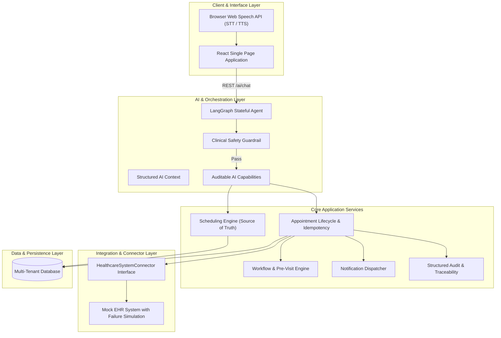
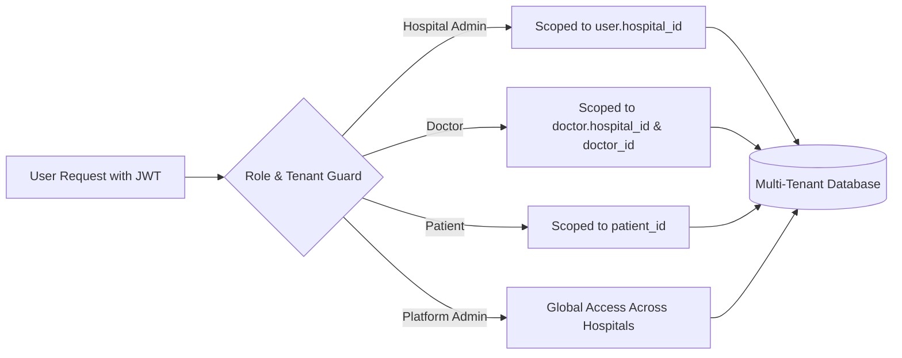
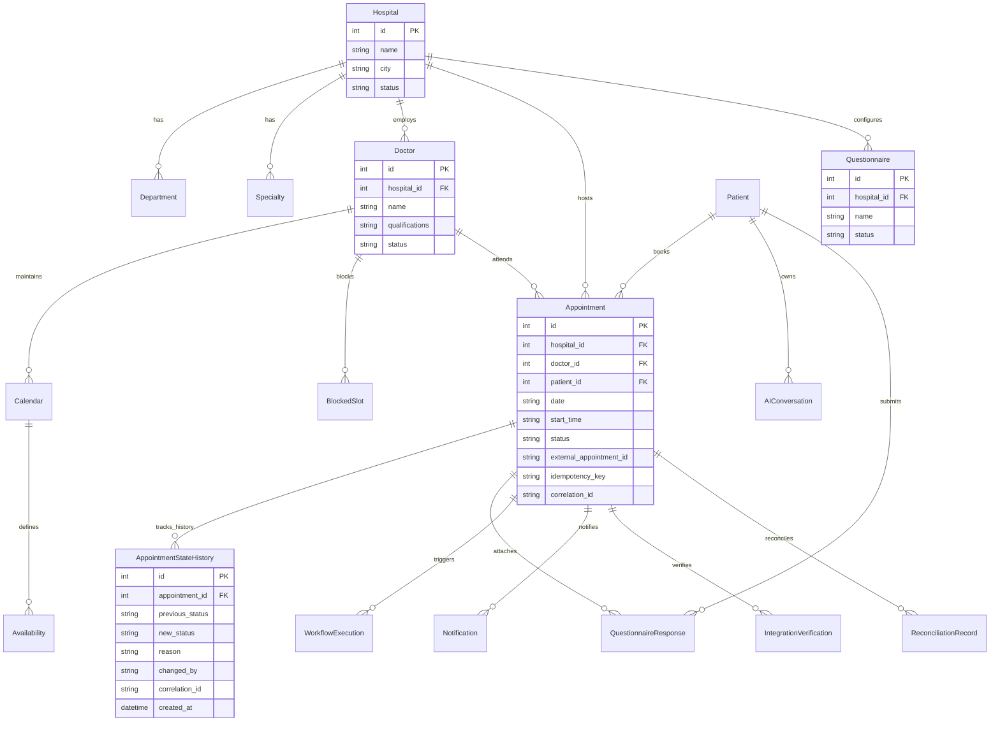
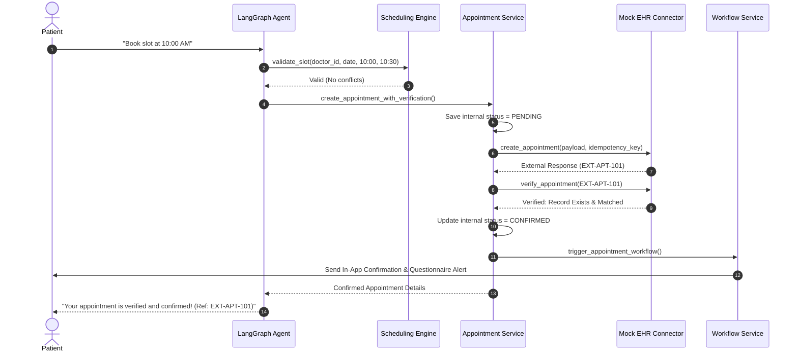
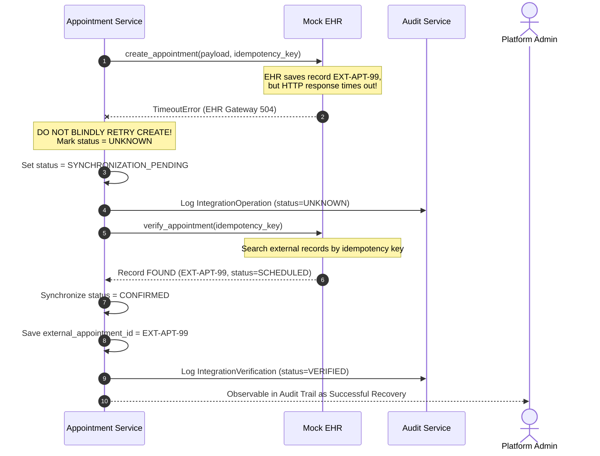
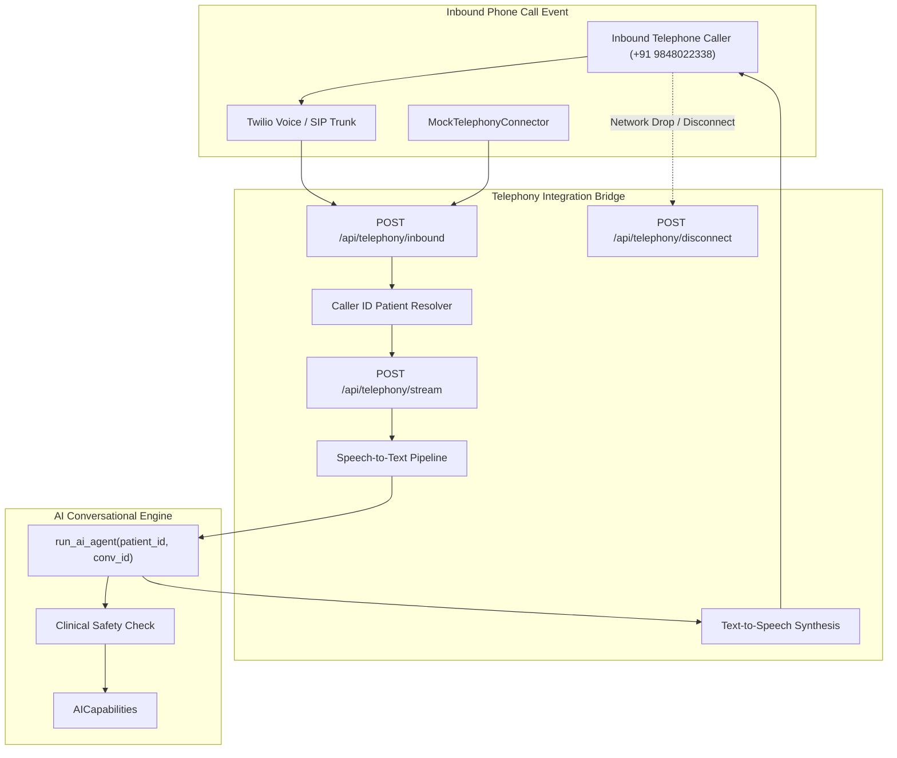
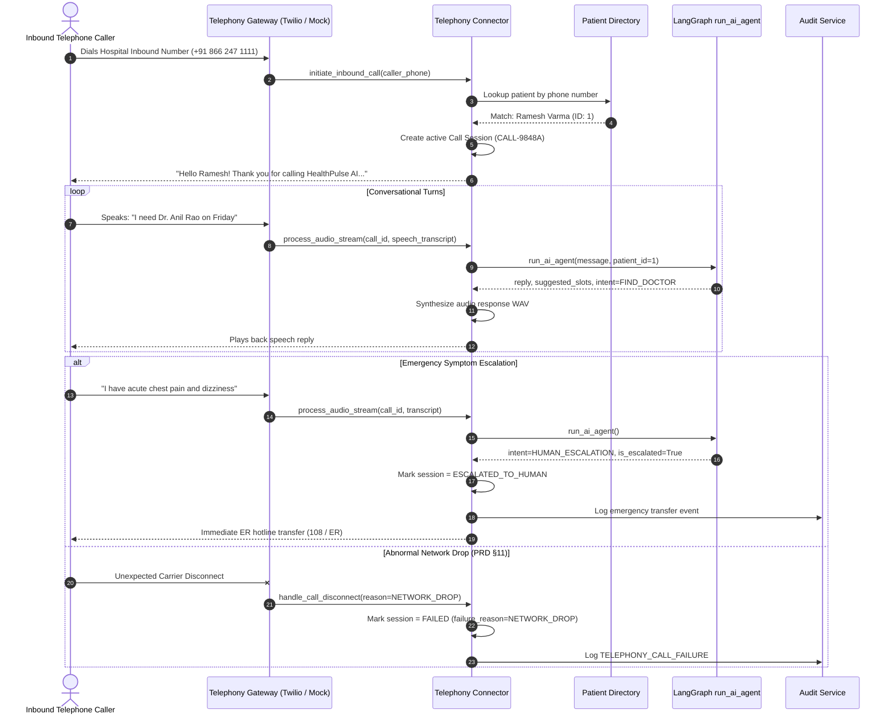

# HealthPulse AI: Architecture Documentation

## 1. High-Level Architecture Overview

The system follows a decoupled, layered architecture where the AI agent operates strictly as an administrative facilitator with zero direct access to databases or external EHRs.

---

## 2. Tenant Isolation Model

Tenant isolation is strictly enforced at the database query level via FastAPI security dependencies.

### Authorization Principles:
- **Hospital Admins** can only manage doctors, availability windows, questionnaires, and workflows belonging to their own hospital.
- **Doctors** can only review appointments and questionnaires for patients scheduled with them.
- **Patients** can only access their own appointments and profiles.
- Cross-tenant database queries return `HTTP 403 Forbidden` with error code `TENANT_ACCESS_DENIED`.

---

## 3. Database Entity Relationship (ER) Diagram

---

## 4. State Machine & Transition Rules (§9, §26)

All appointment status transitions are strictly validated against a finite state machine:

| Current Status | Allowed Next Statuses | Disallowed Invalid Transitions |
|---|---|---|
| `PENDING` | `CONFIRMED`, `FAILED`, `CANCELLED` | `COMPLETED` |
| `CONFIRMED` | `RESCHEDULED`, `CANCELLED`, `COMPLETED` | `PENDING`, `FAILED` |
| `RESCHEDULED` | `CONFIRMED`, `CANCELLED` | `PENDING` |
| `CANCELLED` | *Terminal State (None)* | `CONFIRMED`, `PENDING`, `RESCHEDULED` |
| `COMPLETED` | *Terminal State (None)* | `CANCELLED`, `CONFIRMED`, `RESCHEDULED` |
| `FAILED` | `PENDING`, `CANCELLED` | `COMPLETED`, `CONFIRMED` (without retry) |

Every transition automatically records an immutable row in `AppointmentStateHistory` with actor email and `correlation_id`.

## 5. Booking & Verification Sequence

An appointment is **never** confirmed until independent external verification succeeds.

---

## 6. Unknown Outcome & Timeout Recovery Sequence

Demonstrates recovery when network timeout occurs during EHR creation.

---

## 7. Voice & Telephony Architecture (PRD §11)

HealthPulse AI includes an enterprise-grade, pluggable telephony layer designed to accept inbound telephone calls, resolve patient identity by caller ID, stream conversational audio to the AI state machine, synthesize speech, and handle network disconnects.

### Inbound Phone Call & Failure Handling Sequence

